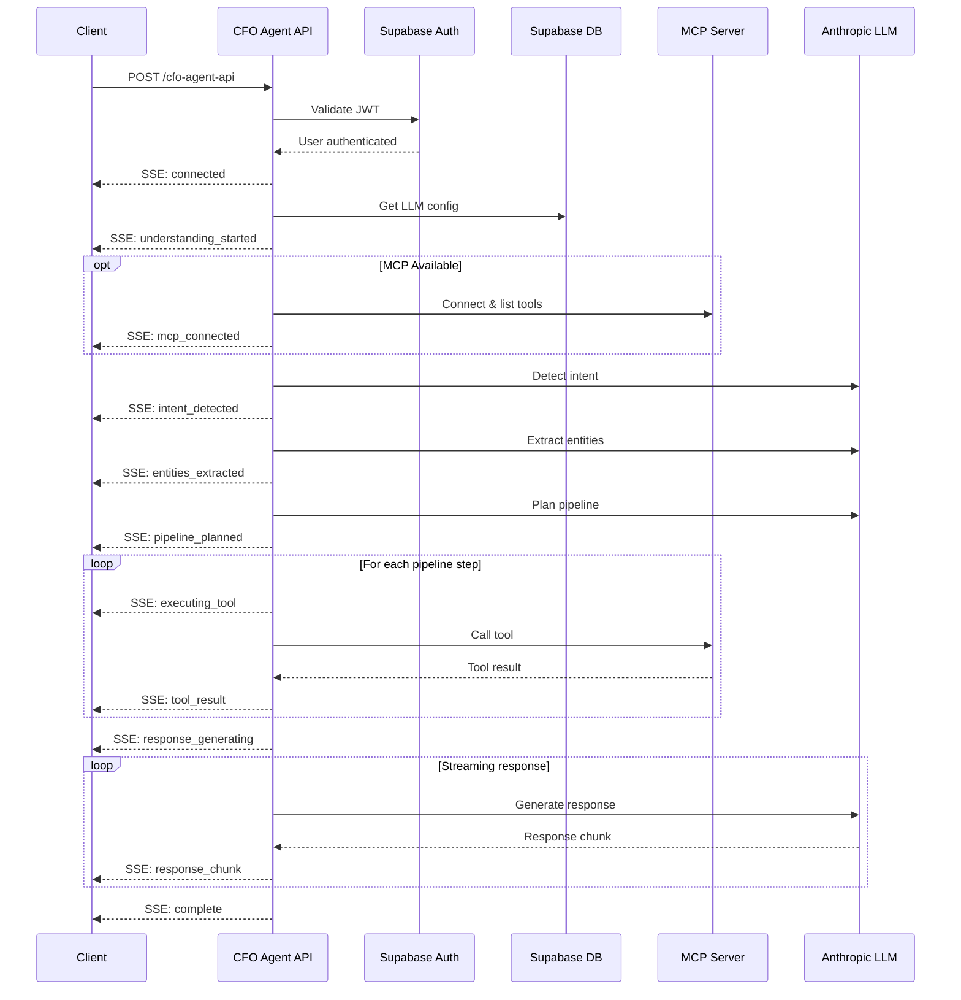

# CFO Agent API - External Frontend Integration Guide

## Overview

The CFO Agent API is a Server-Sent Events (SSE) based API that provides real-time AI-powered financial query processing with MCP (Model Context Protocol) tool integration.

| Property | Value |
|----------|-------|
| **Base URL** | `https://ptftkblnvsybcggbecau.supabase.co` |
| **Endpoint** | `/functions/v1/cfo-agent-api` |
| **Method** | `POST` |
| **Response Type** | `text/event-stream` (SSE) |
| **Authentication** | Bearer Token (Supabase JWT) |

---

## Request Headers

| Header | Required | Description |
|--------|----------|-------------|
| `Content-Type` | Yes | Must be `application/json` |
| `Authorization` | Yes | Supabase JWT token: `Bearer <access_token>` |
| `apikey` | Yes | Supabase publishable key |
| `H-Authorization` | No | MCP Bearer token for HelloBooks integration |

---

## Request Body

### TypeScript Interface

```typescript
interface CFOAgentRequest {
  query: string;                          // Required: The user's question
  stream?: boolean;                       // Optional: Enable SSE streaming (default: true)
  conversationId?: string;                // Optional: Unique conversation identifier
  conversationHistory?: ChatMessage[];    // Optional: Previous messages for context
  entityId?: string;                      // Optional: Entity/company identifier
  orgId?: string;                         // Optional: Organization identifier
}

interface ChatMessage {
  id: string;
  role: 'user' | 'agent';
  content: string;
  timestamp: Date;
  understanding?: AgentUnderstanding;
  isStreaming?: boolean;
  usage?: {
    input_tokens: number;
    output_tokens: number;
    total_tokens: number;
  };
  executionTime?: string;
  llmModel?: string;
}
```

### Example Request Body

```json
{
  "query": "What are my top 5 customers by revenue?",
  "stream": true,
  "conversationId": "conv_abc123",
  "conversationHistory": [],
  "entityId": "entity_xyz",
  "orgId": "org_123"
}
```

---

## SSE Event Types

The API streams events as Server-Sent Events. Each event has the format:

```
data: {"type": "<event_type>", "data": <payload>, "timestamp": "<ISO8601>"}
```

### Event Reference

| Event Type | Description | Data Shape |
|------------|-------------|------------|
| `connected` | Connection established | `{ message: string }` |
| `understanding_started` | Query processing begun | `{ query: string }` |
| `mcp_connected` | MCP client connected | `{ toolCount: number, tools: string[] }` |
| `intent_detecting` | Detecting user intent | `{ status: string }` |
| `intent_detected` | Intent identified | `{ intent: MatchedIntent, reasoning: string }` |
| `entities_extracted` | Entities parsed from query | `{ entities: Record<string, unknown> }` |
| `pipeline_planned` | Execution plan created | `{ steps: PipelineStep[] }` |
| `enrichments_planned` | Data enrichments identified | `{ enrichments: EnrichmentPlan[] }` |
| `executing_tool` | MCP tool being called | `{ tool: string, step: number, total: number }` |
| `tool_result` | Tool execution result | `{ tool: string, success: boolean, recordCount?: number, error?: string }` |
| `response_generating` | LLM generating response | `{ status: string }` |
| `response_chunk` | Streaming response text | `{ chunk: string }` |
| `complete` | Processing complete | `CompleteEventData` |
| `error` | Error occurred | `{ error: string, code?: string }` |

### Supporting Types

```typescript
interface MatchedIntent {
  id?: string;
  name: string;
  moduleId?: string;
  confidence: number;
  description?: string;
}

interface PipelineStep {
  tool: string;
  description: string;
  purpose?: string;
}

interface EnrichmentPlan {
  type: string;
  description: string;
}

interface ToolResult {
  tool: string;
  success: boolean;
  recordCount?: number;
  error?: string;
}

interface AgentUnderstanding {
  intent?: MatchedIntent | null;
  reasoning?: string;
  entities?: Record<string, unknown>;
  pipelineSteps?: PipelineStep[];
  enrichments?: EnrichmentPlan[];
  responseFormat?: string;
  toolResults?: ToolResult[];
  isComplete?: boolean;
}
```

### Complete Event Data

The `complete` event contains the full response payload:

```typescript
interface CompleteEventData {
  query: string;
  matchedIntent: MatchedIntent | null;
  extractedEntities: Record<string, unknown>;
  reasoning: string;
  pipelineSteps: PipelineStep[];
  enrichments: EnrichmentPlan[];
  responseFormat: string;
  response: string;
  mcpToolResults: Array<{
    tool: string;
    input?: Record<string, unknown>;
    result?: string;
    error?: string;
    success: boolean;
  }>;
  dataSources: string[];
  llmModel: string;
  iterationCount: number;
  usage: {
    input_tokens: number;
    output_tokens: number;
    total_tokens: number;
  };
}
```

---

## Code Examples

### JavaScript/TypeScript Implementation

```typescript
interface SSEEvent {
  type: string;
  data: unknown;
  timestamp: string;
}

async function queryCFOAgent(
  query: string,
  accessToken: string,
  onEvent: (event: SSEEvent) => void,
  onComplete: (data: CompleteEventData) => void,
  onError: (error: string) => void
): Promise<void> {
  const API_URL = 'https://ptftkblnvsybcggbecau.supabase.co/functions/v1/cfo-agent-api';
  const API_KEY = 'your-supabase-publishable-key';

  const controller = new AbortController();

  try {
    const response = await fetch(API_URL, {
      method: 'POST',
      headers: {
        'Content-Type': 'application/json',
        'Authorization': `Bearer ${accessToken}`,
        'apikey': API_KEY,
      },
      body: JSON.stringify({
        query,
        stream: true,
      }),
      signal: controller.signal,
    });

    if (!response.ok) {
      const errorText = await response.text();
      throw new Error(`HTTP ${response.status}: ${errorText}`);
    }

    const reader = response.body?.getReader();
    if (!reader) throw new Error('No response body');

    const decoder = new TextDecoder();
    let buffer = '';

    while (true) {
      const { done, value } = await reader.read();
      if (done) break;

      buffer += decoder.decode(value, { stream: true });
      const lines = buffer.split('\n');
      buffer = lines.pop() || '';

      for (const line of lines) {
        if (line.startsWith('data: ')) {
          const jsonStr = line.slice(6).trim();
          if (!jsonStr || jsonStr === '[DONE]') continue;

          try {
            const event: SSEEvent = JSON.parse(jsonStr);
            onEvent(event);

            if (event.type === 'complete') {
              onComplete(event.data as CompleteEventData);
            } else if (event.type === 'error') {
              onError((event.data as { error: string }).error);
            }
          } catch (e) {
            console.warn('Failed to parse SSE event:', jsonStr);
          }
        }
      }
    }
  } catch (error) {
    if (error instanceof Error && error.name !== 'AbortError') {
      onError(error.message);
    }
  }

  return () => controller.abort();
}
```

### React Hook Implementation

```typescript
import { useState, useCallback, useRef } from 'react';

interface UseCFOAgentOptions {
  accessToken: string;
  apiKey: string;
  baseUrl?: string;
}

interface AgentState {
  isLoading: boolean;
  currentPhase: string;
  understanding: AgentUnderstanding;
  response: string;
  error: string | null;
  events: SSEEvent[];
}

export function useCFOAgent(options: UseCFOAgentOptions) {
  const { accessToken, apiKey, baseUrl = 'https://ptftkblnvsybcggbecau.supabase.co' } = options;
  
  const [state, setState] = useState<AgentState>({
    isLoading: false,
    currentPhase: '',
    understanding: {},
    response: '',
    error: null,
    events: [],
  });

  const abortControllerRef = useRef<AbortController | null>(null);

  const sendQuery = useCallback(async (query: string) => {
    // Abort any existing request
    abortControllerRef.current?.abort();
    abortControllerRef.current = new AbortController();

    setState(prev => ({
      ...prev,
      isLoading: true,
      currentPhase: 'understanding_started',
      understanding: {},
      response: '',
      error: null,
      events: [],
    }));

    try {
      const response = await fetch(`${baseUrl}/functions/v1/cfo-agent-api`, {
        method: 'POST',
        headers: {
          'Content-Type': 'application/json',
          'Authorization': `Bearer ${accessToken}`,
          'apikey': apiKey,
        },
        body: JSON.stringify({ query, stream: true }),
        signal: abortControllerRef.current.signal,
      });

      if (!response.ok) {
        throw new Error(`Request failed: ${response.status}`);
      }

      const reader = response.body?.getReader();
      if (!reader) throw new Error('No response body');

      const decoder = new TextDecoder();
      let buffer = '';

      while (true) {
        const { done, value } = await reader.read();
        if (done) break;

        buffer += decoder.decode(value, { stream: true });
        const lines = buffer.split('\n');
        buffer = lines.pop() || '';

        for (const line of lines) {
          if (!line.startsWith('data: ')) continue;
          
          const jsonStr = line.slice(6).trim();
          if (!jsonStr || jsonStr === '[DONE]') continue;

          try {
            const event: SSEEvent = JSON.parse(jsonStr);
            
            setState(prev => {
              const newState = { ...prev, events: [...prev.events, event] };

              switch (event.type) {
                case 'intent_detecting':
                case 'intent_detected':
                case 'entities_extracted':
                case 'pipeline_planned':
                case 'executing_tool':
                case 'response_generating':
                  newState.currentPhase = event.type;
                  break;

                case 'intent_detected':
                  newState.understanding = {
                    ...newState.understanding,
                    intent: (event.data as any).intent,
                    reasoning: (event.data as any).reasoning,
                  };
                  break;

                case 'entities_extracted':
                  newState.understanding = {
                    ...newState.understanding,
                    entities: (event.data as any).entities,
                  };
                  break;

                case 'pipeline_planned':
                  newState.understanding = {
                    ...newState.understanding,
                    pipelineSteps: (event.data as any).steps,
                  };
                  break;

                case 'tool_result':
                  const toolResult = event.data as ToolResult;
                  newState.understanding = {
                    ...newState.understanding,
                    toolResults: [...(newState.understanding.toolResults || []), toolResult],
                  };
                  break;

                case 'response_chunk':
                  newState.response += (event.data as { chunk: string }).chunk;
                  break;

                case 'complete':
                  newState.isLoading = false;
                  newState.currentPhase = 'complete';
                  newState.understanding = { ...newState.understanding, isComplete: true };
                  break;

                case 'error':
                  newState.isLoading = false;
                  newState.error = (event.data as { error: string }).error;
                  break;
              }

              return newState;
            });
          } catch (e) {
            console.warn('Failed to parse event:', jsonStr);
          }
        }
      }
    } catch (error) {
      if (error instanceof Error && error.name !== 'AbortError') {
        setState(prev => ({
          ...prev,
          isLoading: false,
          error: error.message,
        }));
      }
    }
  }, [accessToken, apiKey, baseUrl]);

  const cancel = useCallback(() => {
    abortControllerRef.current?.abort();
    setState(prev => ({ ...prev, isLoading: false }));
  }, []);

  const reset = useCallback(() => {
    setState({
      isLoading: false,
      currentPhase: '',
      understanding: {},
      response: '',
      error: null,
      events: [],
    });
  }, []);

  return {
    ...state,
    sendQuery,
    cancel,
    reset,
  };
}
```

### Usage Example

```tsx
import { useCFOAgent } from './hooks/useCFOAgent';

function CFOChat() {
  const { 
    isLoading, 
    currentPhase, 
    understanding, 
    response, 
    error, 
    sendQuery 
  } = useCFOAgent({
    accessToken: 'user-jwt-token',
    apiKey: 'supabase-publishable-key',
  });

  const handleSubmit = (query: string) => {
    sendQuery(query);
  };

  return (
    <div>
      {isLoading && <PhaseIndicator phase={currentPhase} />}
      {understanding.intent && (
        <IntentDisplay intent={understanding.intent} />
      )}
      {response && <ResponseDisplay content={response} />}
      {error && <ErrorDisplay message={error} />}
    </div>
  );
}
```

---

## Error Handling

### HTTP Status Codes

| Status | Error Code | Description |
|--------|------------|-------------|
| 401 | `MISSING_AUTH` | Authorization header missing |
| 401 | `INVALID_TOKEN` | JWT token is invalid or expired |
| 400 | - | Invalid JSON in request body |
| 405 | - | Method not allowed (use POST) |
| 500 | `LLM_NOT_CONFIGURED` | No LLM configuration found in database |
| 500 | - | Internal server error |

### Error Event Format

```json
{
  "type": "error",
  "data": {
    "error": "Human-readable error message",
    "code": "ERROR_CODE"
  },
  "timestamp": "2024-01-15T10:30:00.000Z"
}
```

---

## Architecture Flow



---

## Best Practices

1. **Always handle the `error` event** - Display user-friendly error messages
2. **Show phase indicators** - Use `currentPhase` to show progress to users
3. **Implement request cancellation** - Use AbortController for long-running queries
4. **Buffer streaming responses** - Append `response_chunk` data for smooth rendering
5. **Store conversation history** - Pass previous messages for context-aware responses
6. **Handle reconnection** - Implement retry logic for network failures

---

## Rate Limits

- Standard Supabase Edge Function limits apply
- Recommended: Implement client-side debouncing (300-500ms)
- Consider caching frequent queries

---

## Support

For issues or questions, contact the development team or refer to the internal API documentation.
